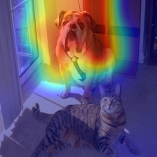
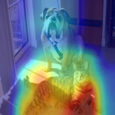
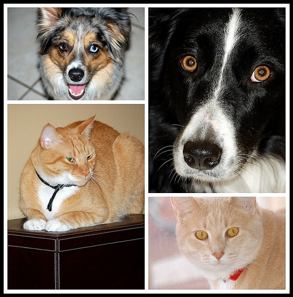
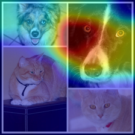

# TensorFlow Grad-CAM Utility
An utility that visualizes your convolutional neural network's "attention" on the region of input image, all operations can be done in a console command, supports frozen model(pb and saved_model format). This is a TensorFlow and Python implementation of Grad-CAM method(https://arxiv.org/abs/1610.02391).

## Prerequisites
Python 3.x with following packages:
* tensorflow 1.x (>= 1.6)
* pillow
* matplotlib

## Usage
```
python grad_cam.py -h
usage: grad_cam.py [-h] [--model_path MODEL_PATH] [--print_tensors]
                   [--input_path INPUT_PATH] [--output_path OUTPUT_PATH]
                   [--input_width INPUT_WIDTH] [--input_height INPUT_HEIGHT]
                   [--preprocess PREPROCESS] [--class_index CLASS_INDEX]
                   [--input_tensor_name INPUT_TENSOR_NAME]
                   [--featuremap_tensor_name FEATUREMAP_TENSOR_NAME]
                   [--logits_tensor_name LOGITS_TENSOR_NAME]
                   [--prediction_tensor_name PREDICTION_TENSOR_NAME]
                   [--per_process_gpu_memory_fraction PER_PROCESS_GPU_MEMORY_FRACTION]

Produce Class Activation Maps (CAM) by Grad-CAM.

optional arguments:
  -h, --help            show this help message and exit
  --model_path MODEL_PATH
                        a frozen model path, either pb or saved_model is
                        supported. NOTE that you MUST assign a directory path
                        which contains model files for save_model format
  --print_tensors       load model then print all tensors' name, it will do
                        nothing else
  --input_path INPUT_PATH
                        an image file path or a directory path that contains
                        images (jpg/png/bmp are supported)
  --output_path OUTPUT_PATH
                        a directory path for CAMs output, the default is the
                        same as input_path
  --input_width INPUT_WIDTH
                        image width of model input
  --input_height INPUT_HEIGHT
                        image height of model input
  --preprocess PREPROCESS
                        vgg or inception, the default is do nothing for
                        preprocess
  --class_index CLASS_INDEX
                        a class index you interested, the default is the most
                        probable class
  --input_tensor_name INPUT_TENSOR_NAME
                        input tensor's name (it doesn't matter whether suffix
                        ':0' is added)
  --featuremap_tensor_name FEATUREMAP_TENSOR_NAME
                        feature map tensor's name (it doesn't matter whether
                        suffix ':0' is added)
  --logits_tensor_name LOGITS_TENSOR_NAME
                        logits tensor's name (it doesn't matter whether suffix
                        ':0' is added)
  --prediction_tensor_name PREDICTION_TENSOR_NAME
                        (optional) prediction tensor's name (it doesn't matter
                        whether suffix ':0' is added)
  --per_process_gpu_memory_fraction PER_PROCESS_GPU_MEMORY_FRACTION
                        (optional) fraction of the available GPU memory to
                        allocate for each process
```

## Examples
### Let's try out!
There is a classification model zoo called [TensorFlow-Slim](https://github.com/tensorflow/models/tree/master/research/slim), which is officially supported by TensorFlow team. I am going to test one of models to demonstrate the usage of the utility.

First of all, download and unzip [mobilenet_v2_1.0_224.tgz](https://storage.googleapis.com/mobilenet_v2/checkpoints/mobilenet_v2_1.0_224.tgz) (check out this [page](https://github.com/tensorflow/models/tree/master/research/slim#pre-trained-models) if the link is unavailable) into the the path `TensorFlow_CAM/mobilenet_v2_1.0_224`. Run with the following command:
```
python grad_cam.py \
    --input_path=images/cat_dog.jpg \
    --input_width=224 \
    --input_height=224 \
    --preprocess=inception \
    --model_path=mobilenet_v2_1.0_224/mobilenet_v2_1.0_224_frozen.pb \
    --input_tensor_name=input \
    --featuremap_tensor_name=MobilenetV2/Conv_1/Relu6 \
    --logits_tensor_name=MobilenetV2/Logits/Squeeze
```
The input is at the left, the ouput image file `result1.png` is at the right:

 

The region that is close to red represents high response to the class 'bull mastiff'(244).

### What if I'm interested in the cat, not the dog?
This utility visualizes the most probable class by default, which was 'bull mastiff'(244) in the previous example.

For this case, just assigns your targeting class index to argument `--class_index`, so the complete command would be:
```
python grad_cam.py \
    --input_path=images/cat_dog.jpg \
    --input_width=224 \
    --input_height=224 \
    --preprocess=inception \
    --class_index=283 \
    --model_path=mobilenet_v2_1.0_224/mobilenet_v2_1.0_224_frozen.pb \
    --input_tensor_name=input \
    --featuremap_tensor_name=MobilenetV2/Conv_1/Relu6 \
    --logits_tensor_name=MobilenetV2/Logits/Squeeze
```
The targeting class is 'tiger cat'(283), the output becomes:



### Batch processing
If there are a bunch of images to be processed, you don't have to run the command many times.

Put them all under the same directory, then assign the directory path to argument `--input_path`. For instance, there are two images under `TensorFlow_CAM/images`, modify the command to:
```
python grad_cam.py \
    --input_path=images \
    --input_width=224 \
    --input_height=224 \
    --preprocess=inception \
    --model_path=mobilenet_v2_1.0_224/mobilenet_v2_1.0_224_frozen.pb \
    --input_tensor_name=input \
    --featuremap_tensor_name=MobilenetV2/Conv_1/Relu6 \
    --logits_tensor_name=MobilenetV2/Logits/Squeeze
```
The input images(at left) and the corresponding output images(at right) as follows:

  'bull mastiff'(244)
  'Border collie'(233)

## License
[MIT License](https://raw.githubusercontent.com/shucheng-liu/TensorFlow_CAM/master/LICENSE)
